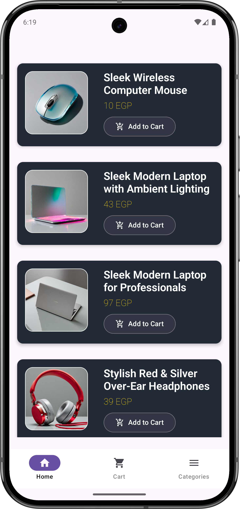
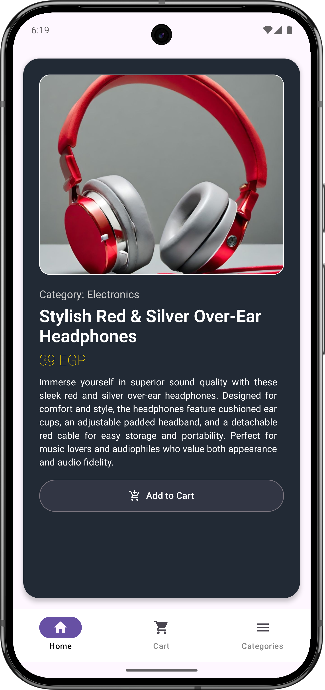
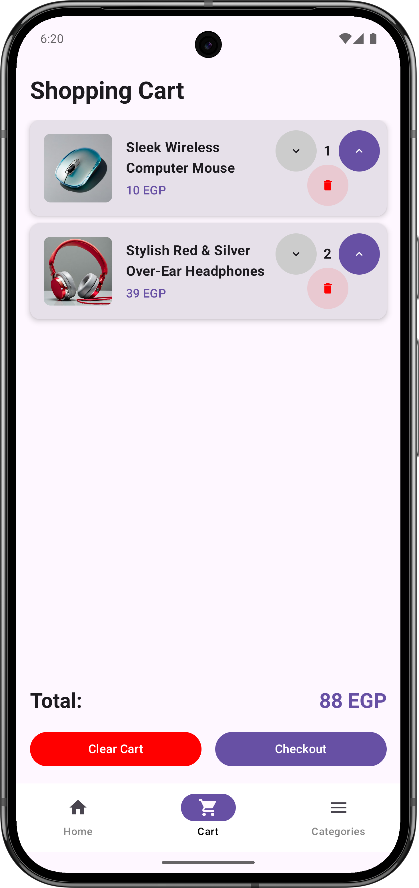
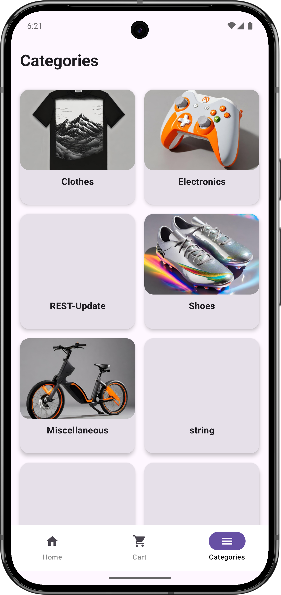
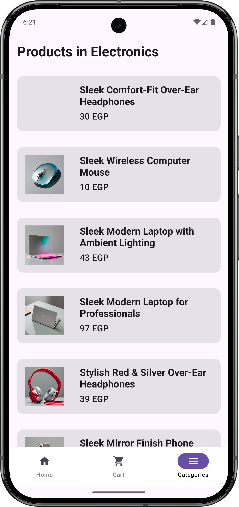

# FakeStore E-Commerce App

A modern Android shopping application built using the [Fake Store API](https://api.escuelajs.co/api/v1). This app allows users to browse products, explore categories, view product details, and manage a local shopping cart with a sleek Material Design interface.

## Project Overview

The FakeStore E-Commerce App provides a seamless shopping experience with the following core features:
- **Browse Products**: View a paginated list of products with infinite scroll support.
- **Explore Categories**: Navigate through product categories and view category-specific products.
- **Product Details**: Access detailed information about each product, including image, title, price, and description.
- **Local Cart**: Add products to a persistent cart stored locally using Room database.
- **User Feedback**: Display network errors and cart actions via snackbars.

## Features

### ◖1◗ Product List
- **Paginated Product Fetching**: Retrieves products from `/products?offset=0&limit=10` with infinite scroll using Paging 3.
- **UI**: Displays products as cards with title, image, price, and an "Add to Cart" button.
- **Feedback**: Shows a snackbar when a product is added to the cart.
- **Loading & Error States**: Includes placeholders for loading states and graceful error handling.
- **Navigation**: Features a button to navigate to the Categories screen.

### ◖2◗ Categories
- **Category List**: Loads categories from `/categories` and displays them as cards with name and image.
- **Category Products**: Navigates to a product list for a selected category using `/categories/{id}/products`, styled similarly to the main product list.

### ◖3◗ Product Details
- **Details Screen**: Fetches and displays product details from `/products/{id}`, including image, title, price, and description.
- **UI**: Presented in a dedicated screen for a focused user experience.

### ◖4◗ Local Cart
- **Cart Management**: Allows users to add products to a local cart, persisted using Room database.
- **Cart Screen**: Displays cart items with name, image, price, and quantity.
- **Total Price**: Calculates and displays the total price at the bottom of the cart screen.

## Tech Stack

- **Networking**: Retrofit + OkHttp for HTTP requests with logging interceptors, timeout, retry, and exponential backoff strategies.
- **Pagination**: Paging 3 for efficient infinite scrolling.
- **Local Storage**: Room database for persistent cart storage.
- **Serialization**: Gson (configurable with Moshi or kotlinx.serialization).
- **Concurrency**: Kotlin Coroutines with suspend functions, async/await, and structured concurrency.
- **Network Monitoring**: ConnectivityManager/NetworkCallback for network status awareness.
- **Error Handling**: Sealed `Result<T>` wrapper for robust success/error handling, with snackbars for user feedback.
- **UI**: Material Design with light/dark theme support.
- **Testing (Optional)**: MockWebServer for API testing.

## API Endpoints

| Feature                  | Endpoint                              | Method |
|--------------------------|---------------------------------------|--------|
| List products (paginated)| `/products?offset=0&limit=10`        | GET    |
| Product details          | `/products/{id}`                     | GET    |
| List categories          | `/categories`                        | GET    |
| Products by category     | `/categories/{id}/products`          | GET    |

**Base URL**: `https://api.escuelajs.co/api/v1`

## Setup Instructions

1. **Clone the Repository**:
   ```bash
   git clone https://github.com/username/fakestore-ecommerce-app.git
   ```

2. **Open in Android Studio**:
   - Open the project in Android Studio.
   - Sync the project with Gradle to download dependencies.

3. **Configure API**:
   - Ensure the base URL (`https://api.escuelajs.co/api/v1`) is set in the networking module.

4. **Run the App**:
   - Build and run the app on an emulator or physical device (API 21+ recommended).

5. **Testing (Optional)**:
   - Run unit tests with MockWebServer for API interactions.


## Getting Started

1. Launch the app to view the **Product List** screen.
2. Use the button on the Product List screen to navigate to the **Categories** screen.
3. Tap a category to view its products.
4. Tap a product to see its **Details** screen.
5. Add products to the cart and view them in the **Cart** screen.
6. Enjoy real-time feedback via snackbars for cart actions and network errors.
## Demo


## Screenshots

| Home Screen | Details Screen |
|-------------|----------------|
|  |  |

| Cart Screen | Categories Screen | Category Products Screen |
|-------------|------------------|--------------------------|
|  |  |  |


## License

This project is licensed under the MIT License - see the [LICENSE](LICENSE) file for details.

## Contributing

Contributions are welcome! Please open an issue or submit a pull request for any improvements or bug fixes.
